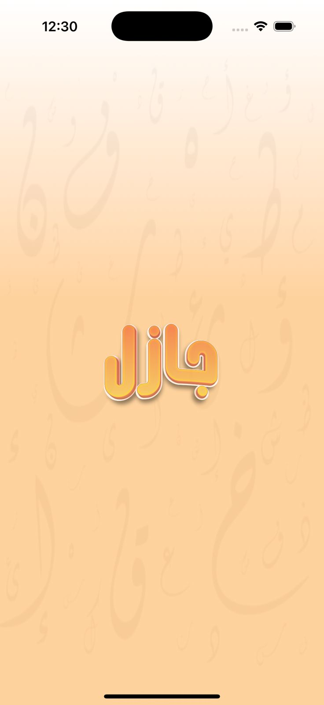
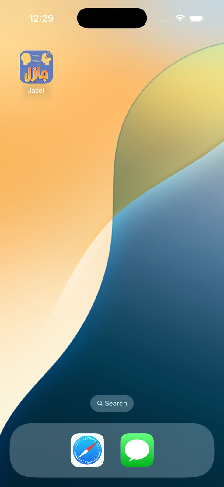
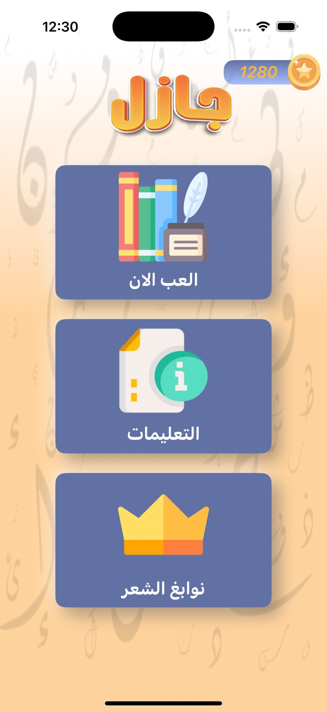
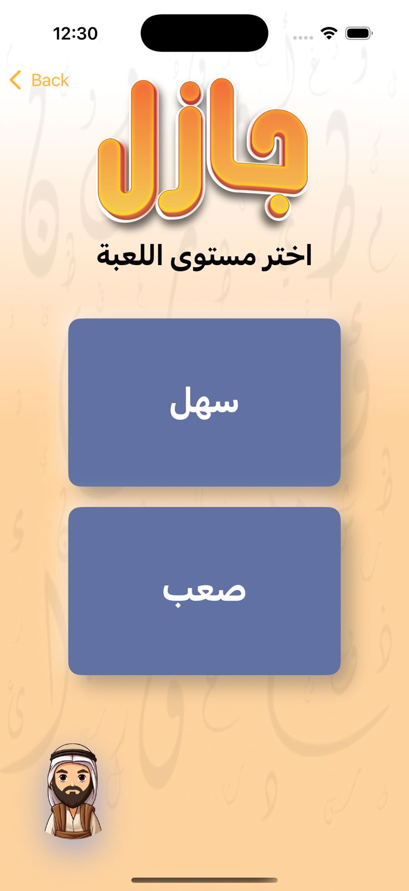
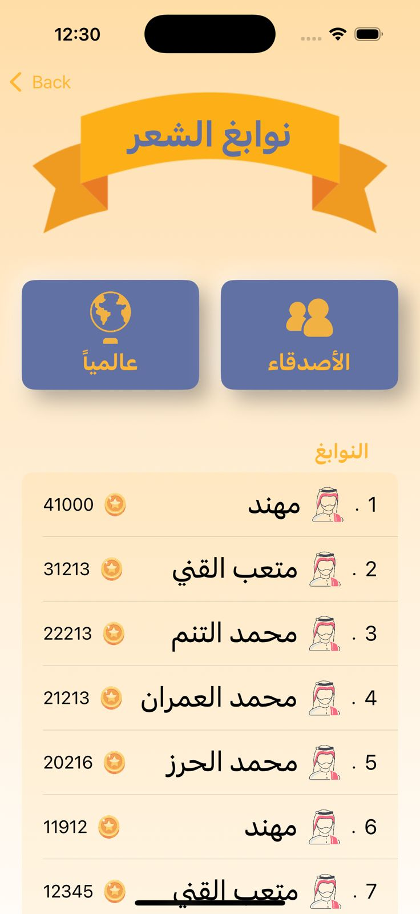
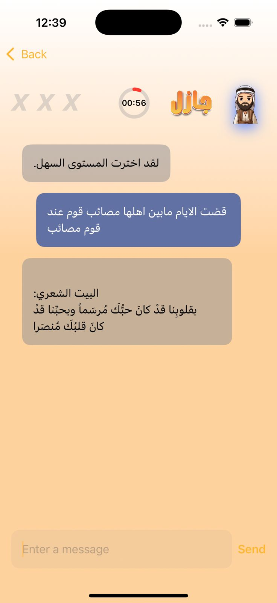
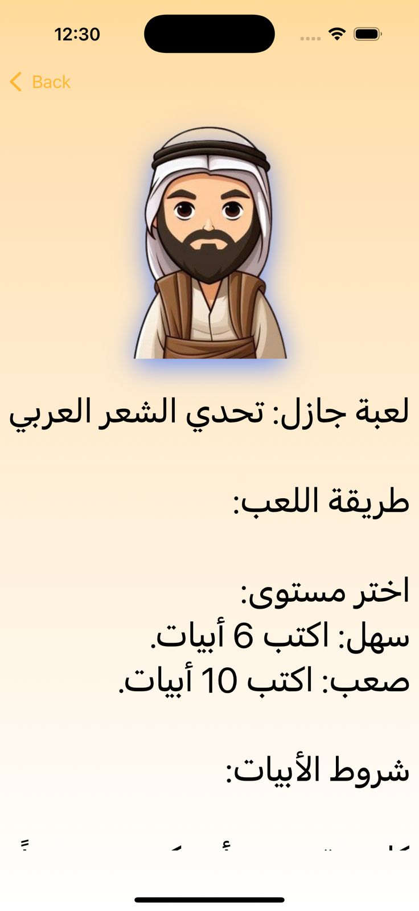

# Project Jazil - Arabic Poetry Game

## Overview
Project Jazil is an innovative Arabic poetry game combining classical Arabic poetry with modern AI technology. Through a powerful backend API and native iOS application (Jazel), users can engage in interactive verse exchanges with an AI system, creating a unique educational and entertaining experience.

### App Launch & Brand

*Jazil's distinctive logo and app launch experience*

### Main Interface

*Main menu featuring Play, Instructions, and Leaderboard options*

## Key Features

### Game Modes

*Choose between Easy (سهل) and Hard (صعب) difficulty levels*

### Leaderboard System

*بواقع الشعر - Competitive poetry leaderboard showing top performers*

### Interactive Gameplay

*Real-time poetry exchange interface with AI*

## System Components

The game offers:
- Real-time verse validation
- Arabic poetry rules enforcement
- Performance tracking
- User rankings and scores
- Educational insights into classical Arabic poetry

*Game instructions and Arabic poetry challenge rules*

## Technical Capabilities
- FastAPI-powered backend with IBM Watson AI integration
- Native iOS application
- Real-time performance metrics
- Automated reporting system
- Secure user data handling

## Platform Support
- iOS 15.0+
- iPhone and iPad compatibility
- Arabic language support
- Internet connection required

[Rest of the technical documentation remains the same...]

Would you like me to:
1. Add more detailed descriptions for each screenshot?
2. Reorganize the layout of the images?
3. Add more technical details about specific features shown in the screenshots?
4. Include user interaction flows between the screens?

The screenshots show:
1. App launch and logo
2. Main menu interface
3. Leaderboard system
4. Game chat interface
5. Difficulty selection
6. Proper Arabic localization
7. Clean, user-friendly design